# FIAP - Faculdade de Informática e Administração Paulista

<p align="center">
<a href= "https://www.fiap.com.br/"></a>
</p>

<br>

# Sompo Predict — Sistema Preditivo de Prevenção de Quebra e Sobrecarga de Maquinário

## Sprint 4 — MVP consolidado, integrado e validado

## 👨‍🎓 Integrantes:
- <a href="https://github.com/monteirogx">Guilherme Bitencourt</a> — RM 574151

## 👩‍🏫 Professores:
### Tutor(a)
- <a href="https://www.linkedin.com/in/sabrina-otoni-22525519b/">Sabrina Otoni</a>
### Coordenador(a)
- <a href="https://www.linkedin.com/in/andregodoichiovato/">André Godoi</a>

## 🎥 Vídeo de demonstração (até 5 min)

**▶️ [Assista no YouTube (não listado)](https://youtu.be/COLOQUE_O_LINK_AQUI)**

---

## 📜 Descrição

Quebras repentinas de tratores, colheitadeiras e pulverizadores geram sinistros caros para a Sompo Seguros e paradas longas para o produtor rural. Este projeto troca a gestão **reativa** (consertar depois da quebra) por uma gestão **preventiva**: o sistema recebe telemetria operacional e ambiental das máquinas e calcula um **score de risco de falha nos próximos 7 dias**. Com base nesse score, gera **alertas e recomendações explicáveis** para cada perfil de usuário, além de relatórios de tendência por **equipamento, região e tipo de operação**.

Na Sprint 4 o protótipo da Sprint 3 virou um **MVP consolidado**:

| Antes (Sprint 3) | Agora (Sprint 4) |
|---|---|
| A API usava uma regra `if temp > 95` fixa no código, e o modelo de ML da Sprint 2 não era usado | A API usa o **modelo treinado**, com validação temporal, versão e hash de integridade |
| 4 variáveis e rótulo determinístico (o modelo só "decorava" a regra) | 10 variáveis operacionais + ambientais + 3 categóricas, com alvo **falha em 7 dias** |
| Avaliação só por acurácia | PR-AUC, ROC-AUC, recall/precisão por nível, Brier e comparação entre 4 modelos |
| Uma única chave de API, e a chave aparecia no README | **5 perfis** com permissões próprias, chaves só no `.env` e comparação por hash |
| Sem logs, sem tratamento de dados sujos, sem testes | Logs técnicos, **auditoria encadeada por hash**, pipeline de limpeza e **96 testes automatizados** |
| Scripts soltos, caminhos fixos | Pacote Python modular, ponto de entrada único (`main.py`) e execução reproduzível |

### 💬 Resposta ao feedback da Sprint 3

| Ponto levantado pela tutoria | O que foi feito na Sprint 4 | Onde verificar |
|---|---|---|
| "O motor preditivo é um conjunto de três regras fixas, e não o modelo treinado na Sprint 2" | A API e o dashboard usam o **modelo treinado** (`modelo.carregar()` → `prever()`). O modelo da Sprint 2 foi **retreinado com as mesmas 4 variáveis** e mantido como *baseline* na comparação. O modelo final supera o baseline em PR-AUC (0,79 × 0,24) | `src/sompo/servico.py`, `src/sompo/modelo.py`, aba *Modelo* |
| "Tabela única, sem cadastro de equipamentos nem separação entre leitura, score e alerta" | 5 tabelas: `equipamentos` (cadastro) · `leituras` (entrada, com hash) · `predicoes` (score, versão do modelo, fatores) · **`alertas`** (ciclo de vida ABERTO → RECONHECIDO → RESOLVIDO, no máximo um ativo por máquina) · `auditoria` | `src/sompo/banco.py`, seção *Arquitetura* |
| "Não há registro de uso das chamadas nem tratamento de exceções no backend" | Middleware registra cada requisição (ID, rota, status, latência) em `logs/sompo.log`. A trilha de `auditoria` registra quem fez o quê, encadeada por hash. Handlers padronizados para 401/403/404/409/422/503/500 | `src/sompo/api.py`, `src/sompo/logger.py` |
| "Não existe simulador de telemetria, as leituras dependem de envio manual pelo Swagger" | Simulador de frota (80 máquinas × 150 dias, com degradação progressiva) e sensores "ao vivo". `python main.py demo` executa 15 cenários automaticamente | `src/sompo/simulador.py`, `src/sompo/demo.py` |
| "O contrato de dados não valida faixas" | Contrato Pydantic com faixas físicas por campo, domínio de região/tipo/operação, coerência tipo × operação, data no futuro e campos extras proibidos. O banco repete as faixas com `CHECK` | `src/sompo/validacao.py` |
| "O painel mostra apenas dois contadores e a tabela, sem filtros, sem agrupamento por equipamento ou região" | Dashboard com login por perfil, filtros (região, operação, período), 6 abas, tendências por **região, operação, tipo e equipamento**, ranking, histórico por máquina, baixa de alertas e auditoria | `dashboard/app.py`, prints abaixo |
| "Sem prints no repositório" | Prints do dashboard, da API e do relatório em `assets/`, exibidos neste README | seção *Relatórios e dashboard* |
| "O README mantém a estrutura de pastas do template e não descreve o que evoluiu" | Estrutura de pastas real, tabela *Antes × Agora* e seção *Evolução nas quatro Sprints* | este README |

### 👥 User Stories atendidas

| Perfil | User Story | Onde é atendida |
|---|---|---|
| **Operador de máquinas** | Quero saber durante a operação se a máquina corre risco, para parar antes de quebrar. | `POST /telemetria` devolve nível e ação imediata · aba *Visão geral* |
| **Técnico de manutenção** | Quero saber **qual componente** inspecionar e com que urgência, e registrar que a manutenção foi feita. | Fatores do score + componente suspeito + prazo (24 h / 72 h) · baixa do alerta (`PATCH /alertas/{id}`) · aba *Equipamento* |
| **Gestor de frota** | Quero ver as máquinas mais críticas e as tendências por região e operação, para planejar paradas e reservas. | Ranking, alertas ativos e aba *Tendências* · `/relatorios/*` · relatório HTML |
| **Analista da seguradora** | Quero rastrear entradas, saídas e decisões do sistema e confiar no modelo, para precificar e auditar sinistros. | Aba *Modelo* (métricas) e *Auditoria* (trilha com hash) · `/auditoria/integridade` |


---

## 🏗️ Arquitetura final

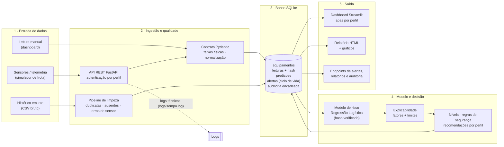

### Fluxo de ponta a ponta de uma leitura

```mermaid
sequenceDiagram
    participant Sensor as Sensor / Operador
    participant API as API (FastAPI)
    participant SEG as Segurança
    participant SRV as Serviço
    participant DB as Banco (SQLite)
    participant ML as Modelo
    Sensor->>API: POST /telemetria + X-API-Key
    API->>SEG: autenticar (hash + tempo constante) e checar permissão
    SEG-->>API: perfil "operador" ✔
    API->>SRV: processar_leitura()
    SRV->>SRV: validar contrato, normalizar, completar sensores ausentes
    SRV->>DB: grava leitura + hash SHA-256 (ANTES do modelo: o dado não se perde)
    SRV->>ML: probabilidade de falha em 7 dias + fatores
    SRV->>SRV: nível, regras de segurança, recomendações
    SRV->>DB: grava predição (versão do modelo); se ALTO/CRÍTICO, abre ou atualiza o alerta da máquina
    SRV->>DB: registra evento de auditoria encadeado
    API-->>Sensor: score, nível, fatores, recomendações por perfil
```

| Camada | Módulo | Responsabilidade |
|---|---|---|
| Configuração | `src/sompo/config.py` | Caminhos, faixas válidas, limites operacionais, critérios de nível, perfis e permissões, **tudo explícito em um só lugar** |
| Coleta | `src/sompo/simulador.py` | Frota simulada (80 máquinas × 150 dias), leituras ao vivo e injeção de inconsistências |
| Qualidade | `src/sompo/validacao.py` | Contrato da leitura (Pydantic) e limpeza de lote com relatório de qualidade |
| Dados | `src/sompo/banco.py` | Esquema normalizado com `CHECK`/`UNIQUE`/FK, hash por leitura, ciclo de vida dos alertas, auditoria encadeada |
| Modelo | `src/sompo/modelo.py` | Treino, comparação, validação temporal, métricas, persistência com hash, explicabilidade |
| Decisão | `src/sompo/risco.py` | Níveis, regras de segurança, fatores e recomendações por perfil |
| Orquestração | `src/sompo/servico.py`, `pipeline.py` | Fluxo de uma leitura (API/dashboard) e fluxo batch completo |
| Segurança | `src/sompo/seguranca.py` | Autenticação, autorização, pseudonimização (HMAC) e hashes |
| Saída | `src/sompo/api.py`, `dashboard/app.py`, `relatorios.py` | API REST, dashboard por perfil e relatório HTML |
| Observabilidade | `src/sompo/logger.py` | Log técnico rotativo com ID de requisição |

---

## 📁 Estrutura de pastas

```
Challenge_Sompo_Sprint4/
├── main.py                  # ponto de entrada único (pipeline, api, dashboard, demo, testes...)
├── src/sompo/               # código-fonte modular (ver tabela acima)
├── dashboard/app.py         # dashboard Streamlit
├── tests/                   # 96 testes automatizados (pytest)
├── models/                  # modelo final (.joblib) + metricas_modelo.json (com SHA-256)
├── reports/                 # relatório HTML consolidado
├── docs/
│   ├── evidencias/          # evidências de validação (testes, demo, qualidade, gráficos)
│   └── roteiro_video.md     # roteiro do vídeo de 5 minutos
├── data/raw | processed     # gerados pelo pipeline (CSV bruto e tratado)
├── logs/                    # log técnico (gerado em execução)
├── assets/                  # logo e prints do dashboard, da API e do relatório
├── .env.example             # modelo de configuração de segredos (o .env real não é versionado)
├── requirements.txt
└── pyproject.toml           # configuração do pytest
```

---

## 🔧 Como executar

**Pré-requisitos:** Python 3.10 ou superior.

```bash
# 1. Instalar dependências
pip install -r requirements.txt

# 2. Configurar os segredos: copie o modelo e troque as chaves
cp .env.example .env          # no Windows: copy .env.example .env
# gere chaves fortes com: python -c "import secrets; print(secrets.token_urlsafe(24))"

# 3. Rodar o pipeline completo (≈30 s): coleta → limpeza → banco → treino → scores → relatório
python main.py pipeline

# 4. Subir a API   (terminal 1) → http://localhost:8000/docs
python main.py api

# 5. Subir o dashboard (terminal 2) → http://localhost:8501  (entre com a chave de um perfil)
python main.py dashboard

# 6. Demonstração: envia leituras reais/erradas para a API em execução (terminal 3)
python main.py demo

# Outros comandos
python main.py testes      # suíte de testes automatizados
python main.py verificar   # confere a integridade das leituras, da auditoria e do modelo
python main.py relatorio   # regenera reports/relatorio_risco.html
```

### Perfis de acesso

| Perfil | Enviar telemetria | Ver alertas | Tratar alertas | Relatórios | Modelo | Auditoria |
|---|:-:|:-:|:-:|:-:|:-:|:-:|
| `operador` | ✅ | ✅ | — | — | — | — |
| `tecnico` | ✅ | ✅ | ✅ | ✅ | — | — |
| `gestor` | — | ✅ | ✅ | ✅ | — | — |
| `analista` | — | ✅ | — | ✅ | ✅ | ✅ |
| `admin` | ✅ | ✅ | ✅ | ✅ | ✅ | ✅ |

### Principais endpoints

| Método | Rota | Permissão | Descrição |
|---|---|---|---|
| GET | `/saude` | pública | Status e versão do modelo |
| GET | `/contrato` | pública | Esquema da leitura, faixas válidas e critérios de risco |
| POST | `/telemetria` | enviar_telemetria | Uma leitura → score, nível, fatores, recomendações |
| POST | `/telemetria/lote` | enviar_telemetria | Até 500 leituras; itens inválidos não interrompem os demais |
| GET | `/alertas` | ver_alertas | Alertas registrados (padrão: ABERTO e RECONHECIDO; filtros por status, região e operação) |
| PATCH | `/alertas/{id}` | tratar_alertas | Reconhecer (inspeção agendada) ou resolver (manutenção feita) um alerta, com observação |
| GET | `/equipamentos/{id}/historico` | ver_alertas | Histórico de scores de um equipamento |
| GET | `/relatorios/visao-geral` · `/resumo` · `/tendencia` | ver_relatorios | KPIs, resumo e tendência por equipamento, região, operação ou tipo |
| GET | `/modelo` | ver_modelo | Métricas completas e versão do modelo |
| GET | `/auditoria` · `/auditoria/integridade` | ver_auditoria | Trilha de auditoria e verificação dos hashes |

---

## 🧹 Engenharia de dados

O pipeline recebe um CSV bruto **sujo de propósito**, como chegaria de sensores reais, e registra tudo o que corrigiu ou descartou ([`docs/evidencias/execucao_pipeline.json`](docs/evidencias/execucao_pipeline.json)):

| Problema no dado bruto | Tratamento | Ocorrências |
|---|---|---:|
| Textos fora do padrão (`" mt "`, `"Mato Grosso"`, `"eq-012"`, `"pulverizacao"`) | Normalização para o domínio oficial | 643 |
| Registros duplicados (reenvio do sensor) | Removidos por `(equipamento, data_hora)` | 153 |
| Data corrompida / sem identificação | Linha descartada | 20 |
| Valores fisicamente impossíveis (`-999 °C`, RPM negativo, umidade 150%) | Anulados como erro de sensor | 90 |
| Mais de 3 sensores ausentes na mesma leitura | Linha descartada (baixa qualidade) | 30 |
| Sensor ausente (até 3 por leitura) | Mediana do próprio equipamento → mediana geral; contagem registrada | 1.103 valores |
| **Resultado** | **10.153 de 10.356 linhas aproveitadas (98,0%)**, 0 perdas na carga, 100% dos hashes conferidos | |

O banco também se protege sozinho: restrições `CHECK` recusam valores fora da faixa mesmo em um `INSERT` manual, `UNIQUE` impede duplicatas e chaves estrangeiras garantem que toda predição aponta para uma leitura real.

---

## 🧠 Modelo preditivo

**Alvo:** `falha_7d`, que indica se a máquina teve falha nos 7 dias seguintes à leitura. O horizonte de 7 dias é o que dá tempo de agir. As leituras dos últimos 7 dias do histórico ficam **sem rótulo**, porque o futuro delas ainda não é conhecido (janela censurada). Por isso não entram no treino.

**Variáveis:** idade, horas de uso contínuo, RPM, temperatura do motor, pressão do óleo, vibração, carga do motor, temperatura ambiente, umidade, declividade do terreno, tipo de equipamento, região e tipo de operação.

**Avaliação:** divisão **temporal**. O modelo treina com abril a julho e é testado a partir de 24/07, um período que ele nunca viu. A escolha do algoritmo usa uma janela de validação separada, também temporal, para que o teste não influencie a escolha.

| Modelo | PR-AUC validação | **PR-AUC teste** | ROC-AUC teste | Brier | Recall (ALTO) | Precisão (ALTO) |
|---|---:|---:|---:|---:|---:|---:|
| Baseline Sprint 2 (RF, 4 variáveis) | 0,208 | 0,244 | 0,717 | 0,085 | 22% | 30% |
| **Regressão Logística ✅ escolhido** | **0,699** | **0,794** | **0,968** | **0,042** | **76%** | **69%** |
| Random Forest | 0,683 | 0,760 | 0,959 | 0,049 | 66% | 71% |
| Gradient Boosting | 0,674 | 0,775 | 0,961 | 0,042 | 76% | 71% |

<p align="center">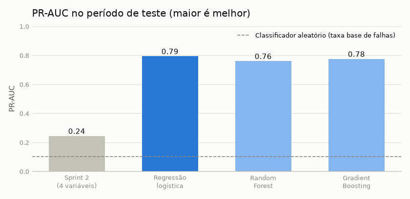</p>

**Por que essas escolhas:**
- **PR-AUC como métrica principal.** Só ~10% das leituras antecedem uma falha. Um modelo que responde sempre "não quebra" teria 90% de acurácia e não serviria para nada. A PR-AUC mede o que importa: encontrar as falhas sem inundar a oficina de alarmes falsos. A taxa base (sorteio) é 0,10.
- **Regressão Logística venceu** na validação, empatou com o Gradient Boosting no teste e tem vantagens práticas: probabilidades bem calibradas (menor Brier, importante porque o score é exibido como % de risco), treino em menos de 1 segundo e comportamento fácil de explicar para a seguradora.
- **Revisão de variáveis.** O ganho de 0,24 para 0,79 de PR-AUC em relação à Sprint 2 vem das novas variáveis. Na importância por permutação, **vibração** (−0,47 de PR-AUC quando embaralhada), **pressão do óleo** (−0,16) e **idade** (−0,14) são as que mais pesam. Isso é coerente com a curva P-F da manutenção: a degradação aparece primeiro na vibração e na lubrificação.
- **Integridade do modelo.** O SHA-256 do arquivo `.joblib` fica em `metricas_modelo.json` e é conferido a cada carga. Um modelo adulterado é recusado e a API responde `503` em vez de gerar scores falsos.

---

## 🚨 Score, alertas e recomendações

**Score = probabilidade estimada de falha nos próximos 7 dias × 100.** Os cortes dos níveis foram definidos a partir da curva precisão × recall do período de teste:

| Nível | Critério | O que significa (período de teste) | Ação |
|---|---|---|---|
| 🟢 BAIXO | score < 10 | — | Operação liberada |
| 🟡 MODERADO | 10 ≤ score < 25 | Captura 92% das falhas (rede de segurança) | Acompanhar / incluir na próxima revisão |
| 🟠 **ALTO** (alerta) | 25 ≤ score < 60 | **76% das falhas detectadas, 69% dos alertas corretos** | Inspeção em até 72 h, reduzir carga |
| 🔴 **CRÍTICO** (alerta) | score ≥ 60 **ou** regra de segurança | 83% dos alertas corretos: justifica parar a máquina | Parar e inspecionar em até 24 h |

**Ciclo de vida do alerta.** Quando uma leitura cai em ALTO ou CRÍTICO, o sistema abre um registro na tabela `alertas`. Se a máquina já tem um alerta ativo, ele é **atualizado**, e não duplicado. O técnico ou o gestor muda o status para **RECONHECIDO** (inspeção agendada) e depois para **RESOLVIDO** (manutenção feita), com observação. Se o risco subir de ALTO para CRÍTICO depois do reconhecimento, o alerta **volta para ABERTO**. Um alerta resolvido não pode ser reaberto: uma nova leitura de risco abre um alerta novo. Toda mudança fica na auditoria.

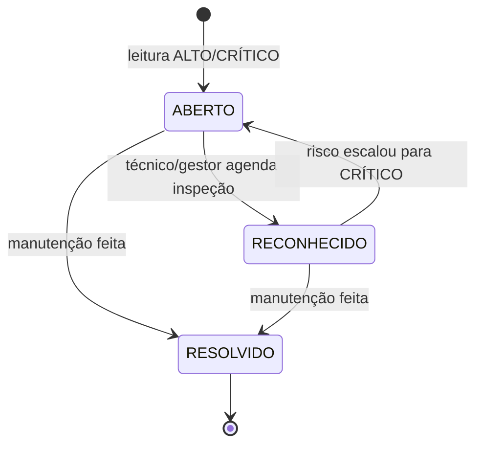

**Regras de segurança** (forçam CRÍTICO mesmo que o modelo discorde): motor ≥ 110 °C, pressão do óleo ≤ 12 psi, vibração ≥ 11,2 mm/s (zona de dano da ISO 10816).

**Explicabilidade.** Cada score vem com:
1. **Principais contribuições do modelo**: quanto o risco cairia se aquela variável estivesse no valor típico de uma máquina saudável (ex. real da demo: *"Vibração = 8,4 mm/s (típico saudável 4,8) → +37,6 pontos; Pressão do óleo = 26,6 psi (típico 45,3) → +18 pontos"*);
2. **Limites operacionais violados**, cada um com o **componente** a inspecionar (ex.: vibração > 7,1 → *rolamentos, eixos e transmissão*);
3. **Recomendação específica para cada perfil** (operador, técnico, gestor e analista).

---

## 🛡️ Segurança e rastreabilidade

| Controle | Implementação | Evidência |
|---|---|---|
| Segredos fora do código | Chaves e segredo só no `.env` (ignorado pelo Git); `.env.example` como modelo | teste `test_nenhuma_chave_de_api_no_codigo_fonte` |
| Autenticação | Chave por perfil em `X-API-Key`; comparação de hashes SHA-256 em tempo constante | `401` nos testes e na demo |
| Autorização (menor privilégio) | 5 perfis e matriz de permissões, iguais na API e no dashboard | `403` nos testes e na demo |
| Validação de entrada | Contrato Pydantic (`extra="forbid"`, faixas físicas, domínio, coerência tipo × operação) + `CHECK` no banco | `422` detalhado |
| SQL injection | 100% das consultas parametrizadas | código `banco.py` |
| Proteção de dados pessoais (LGPD) | Matrícula do operador gravada só como pseudônimo HMAC-SHA256 | teste `matrícula nunca é gravada em claro` |
| Integridade das leituras | Hash SHA-256 do conteúdo de cada leitura, recalculado sob demanda | teste de adulteração detectada |
| Trilha de auditoria à prova de adulteração | Cada evento guarda o hash do anterior (corrente). Editar ou apagar um evento quebra a corrente | `/auditoria/integridade`, testes de edição e exclusão |
| Integridade do modelo | SHA-256 do `.joblib` conferido a cada carga | teste `modelo adulterado não é carregado` |
| Logs técnicos | `logs/sompo.log` rotativo, com ID de requisição, método, rota, status e latência | cabeçalho `X-Request-ID` |
| Rastreabilidade da decisão | Cada predição guarda versão do modelo, score, fatores, regra acionada e recomendação, ligada à leitura de origem | tabela `predicoes` / view `vw_risco` |

**O que é auditado:** envio de leituras (aceitas, rejeitadas e duplicadas), abertura e tratamento de alertas, logins e logouts no dashboard, tentativas sem chave ou sem permissão, consultas de alertas e históricos, verificações de integridade e execuções do pipeline.

---

## ✅ Validação do MVP (evidências)

| Evidência | Arquivo |
|---|---|
| **96 testes automatizados, todos passando** | [`docs/evidencias/resultado_testes.txt`](docs/evidencias/resultado_testes.txt) |
| Execução do pipeline (qualidade, carga sem perda, métricas) | [`docs/evidencias/execucao_pipeline.json`](docs/evidencias/execucao_pipeline.json) |
| Demo da API com 15 cenários (normal, crítico, ausentes, inválido, duplicado, 401, 403, lote, baixa de alerta...) | [`docs/evidencias/demo_api_saida.txt`](docs/evidencias/demo_api_saida.txt) · [`demo_api.json`](docs/evidencias/demo_api.json) |
| Verificação de integridade (leituras, auditoria, modelo) | [`docs/evidencias/verificacao_integridade.json`](docs/evidencias/verificacao_integridade.json) |
| Métricas completas do modelo | [`models/metricas_modelo.json`](models/metricas_modelo.json) |
| Relatório consolidado de risco | [`reports/relatorio_risco.html`](reports/relatorio_risco.html) |

**O que os testes cobrem:**

| Arquivo | Foco |
|---|---|
| `test_validacao.py` | Normalização, 8 tipos de leitura inválida, limpeza de lote (a contabilidade fecha 100%) e dados corretos que não são alterados |
| `test_banco_seguranca.py` | Duplicatas, `CHECK` no banco, adulteração de leitura e da auditoria detectada, autenticação, matriz de permissões, pseudonimização |
| `test_modelo_risco.py` | Desempenho mínimo, ganho sobre o baseline, divisão temporal sem vazamento, janela censurada, reprodutibilidade, modelo adulterado, cortes de nível, regras de segurança |
| `test_api.py` | 401/403/404/409/422/503; fluxo completo leitura → predição → alerta → auditoria; **ciclo de vida do alerta** (sem duplicar, reconhecer, resolver, não reabrir, reescalar); sensores ausentes; lote parcial; relatórios |
| `test_integracao.py` | **Confiabilidade da coleta:** 340 leituras enviadas individualmente, em lote e **em paralelo (8 threads)**, com o hash de cada uma conferido contra o que o sensor enviou (0 perdas, 0 corrupções). Também: máquinas degradadas recebem score maior e o dashboard abre sem erro para os 5 perfis |

---

## 📊 Relatórios e dashboard

<p align="center">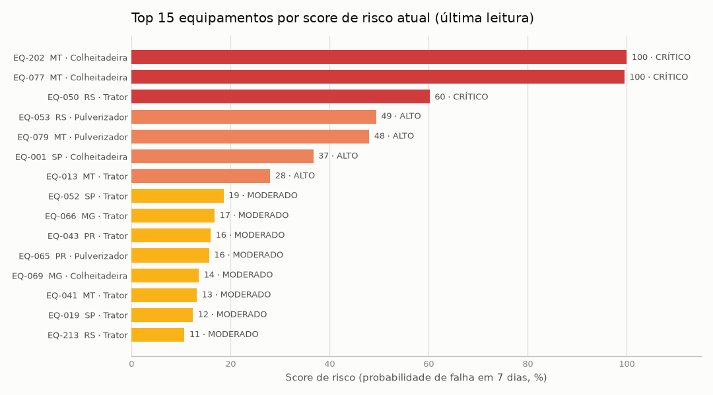</p>
<p align="center">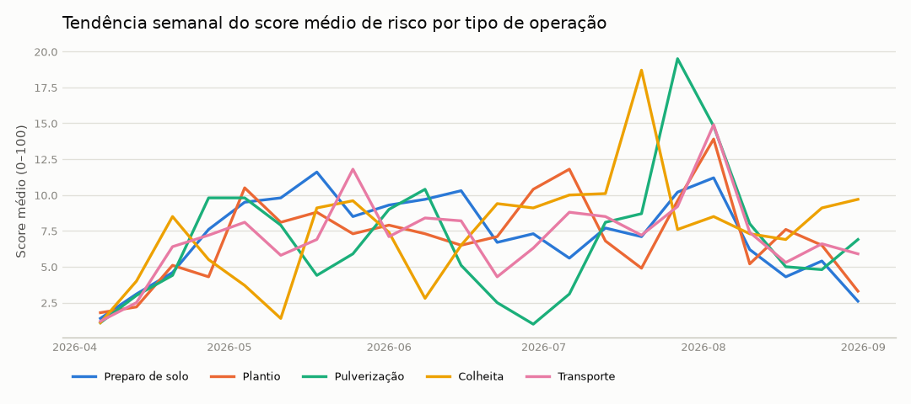</p>
<p align="center">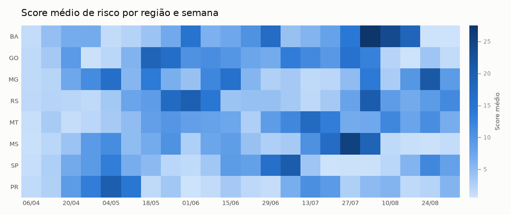</p>

O **dashboard** (Streamlit) mostra a cada perfil só as abas permitidas:
- **📊 Visão geral:** KPIs, frota por nível, top 15 por risco e alertas ativos com a recomendação **para o perfil logado**;
- **📈 Tendências:** score médio semanal ou diário por região, tipo de operação, tipo de equipamento ou equipamento, com resumo exportável em CSV;
- **🔧 Equipamento:** evolução do score com as faixas de nível, sensores com limites operacionais, "por que este score?" e recomendações;
- **➕ Nova leitura:** registro manual com as mesmas validações da API;
- **🧠 Modelo:** métricas, comparação, importância das variáveis e desempenho em cada corte;
- **🛡️ Auditoria:** trilha de eventos e botão de verificação de integridade.

### Prints

**Visão geral (gestor de frota):** KPIs, frota por nível, ranking e alertas com status e baixa
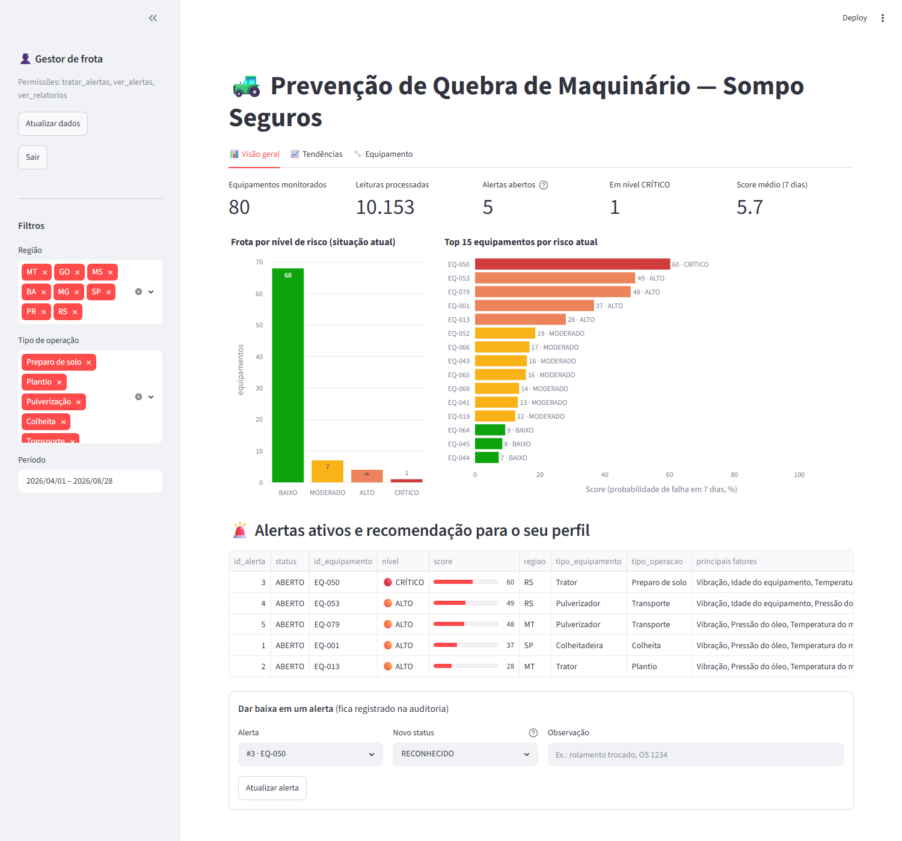

**Tendências por região:** score médio semanal e resumo exportável
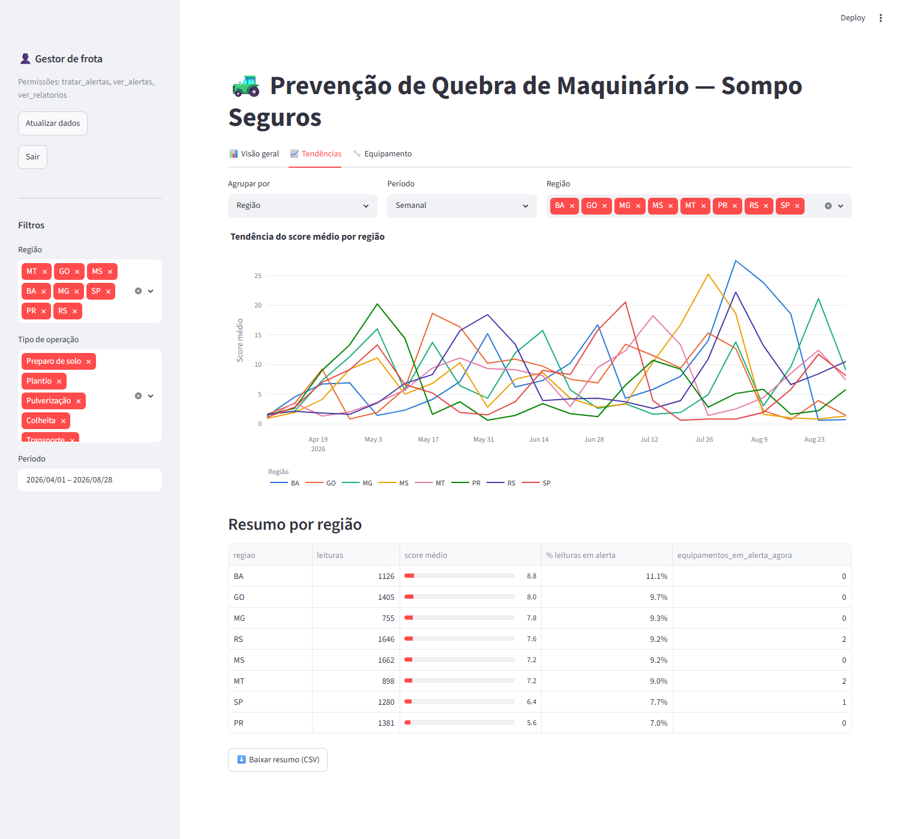

**Equipamento:** evolução do score de uma máquina (degradação → quebra → manutenção → nova degradação), sensores × limites e explicação do score
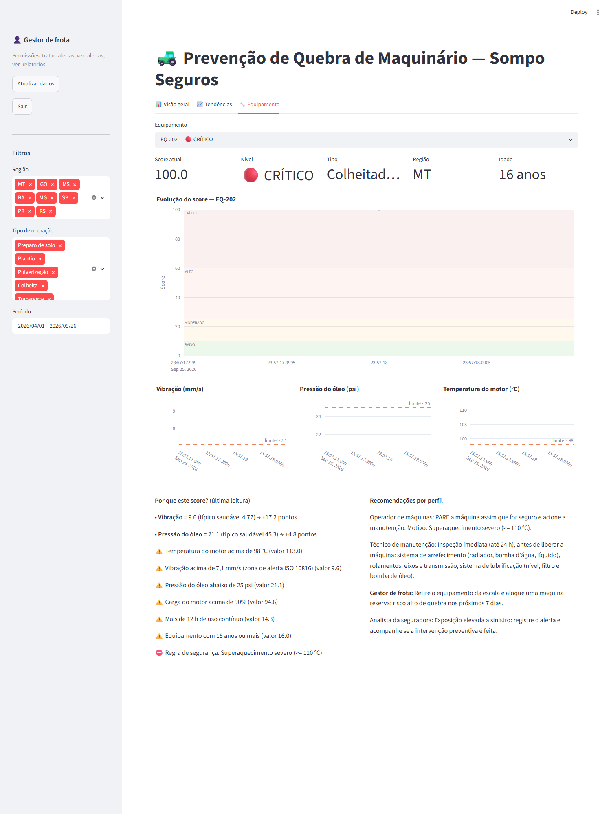

**Modelo (analista da seguradora):** métricas, comparação com o baseline da Sprint 2, importância das variáveis e desempenho por nível
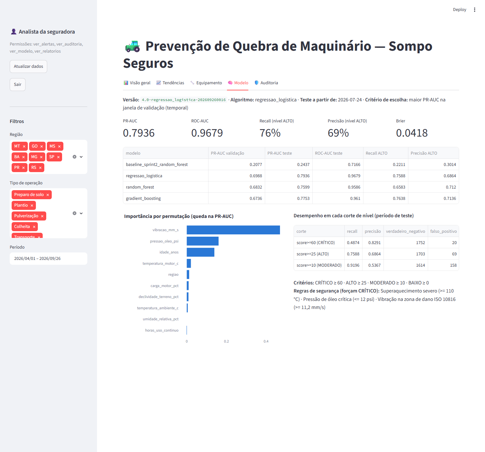

**Auditoria (analista da seguradora):** trilha de eventos e verificação de integridade por hash
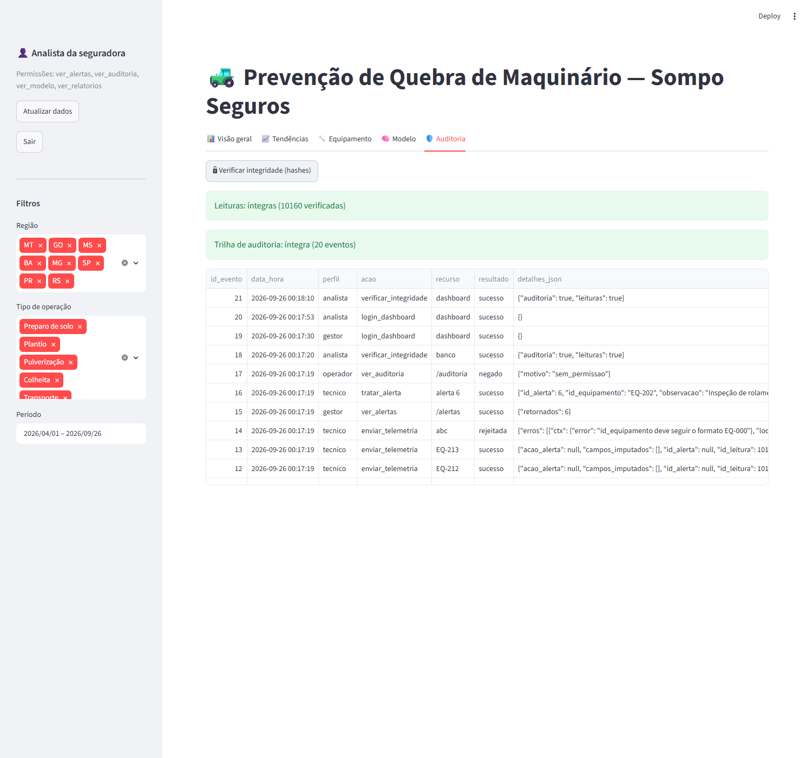

**API:** rotas documentadas no Swagger e resposta de `POST /telemetria` com score, nível, alerta e fatores
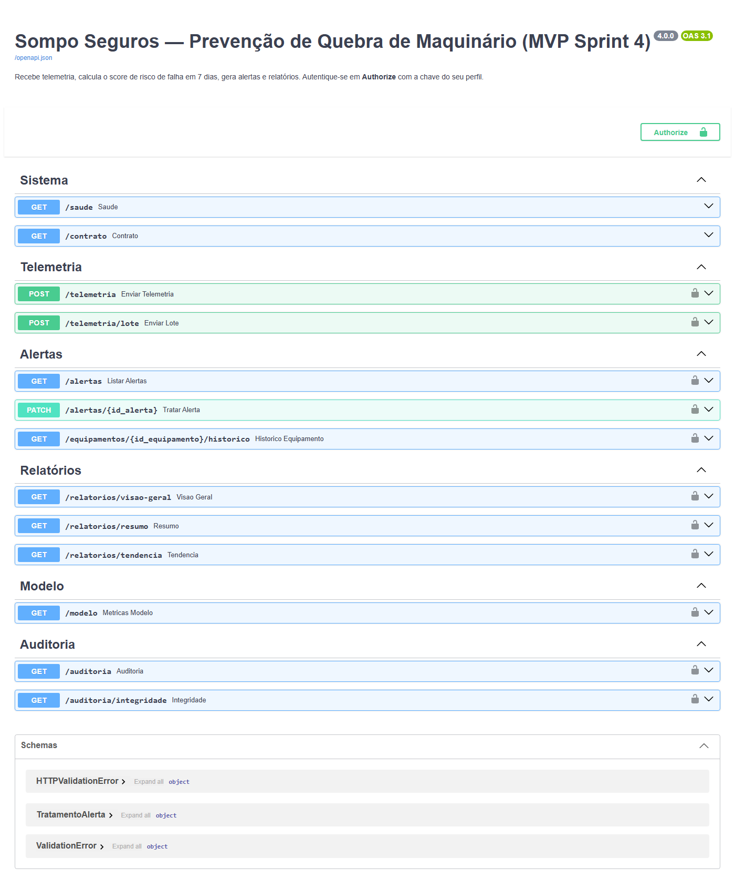
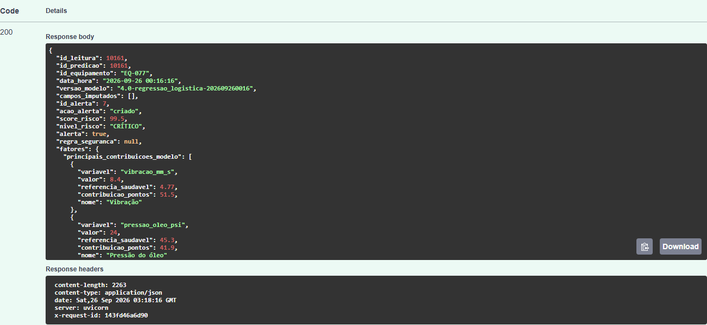

**Relatório HTML** (`reports/relatorio_risco.html`)
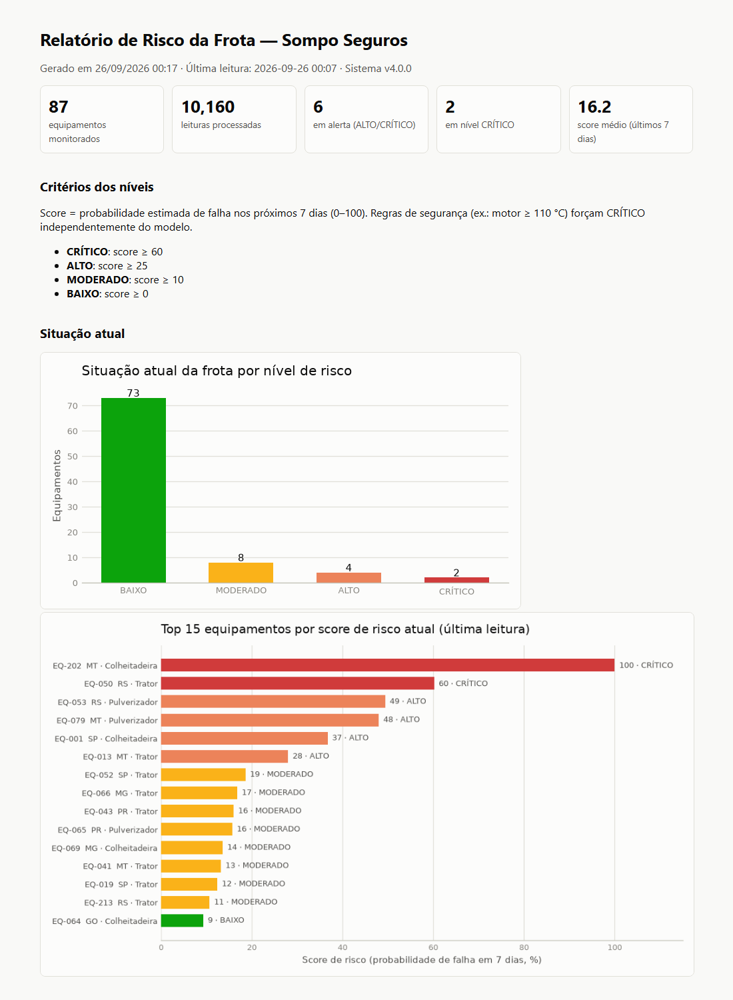

---

## 🧭 Evolução do projeto nas quatro Sprints

| Sprint | Entrega | Decisões técnicas |
|---|---|---|
| **1** — Entendimento | Mapeamento da dor da Sompo (sinistros por quebra/sobrecarga), User Stories por perfil e escopo preventivo | Foco em **prevenção** (prever antes da falha), e não em detectar a falha depois |
| **2** — Dados e modelo | Dataset simulado de telemetria, banco SQLite, análise exploratória e Random Forest | SQLite pela simplicidade, pandas para análise e scikit-learn pelo ecossistema maduro |
| **3** — Integração | API FastAPI protegida por chave, persistência e dashboard Streamlit | FastAPI pela validação nativa (Pydantic) e Swagger automático; Streamlit pela velocidade de prototipação |
| **4** — Consolidação | **Este MVP**: arquitetura modular, modelo refeito com validação temporal, qualidade de dados, tabela de alertas com ciclo de vida, perfis de acesso, auditoria encadeada, explicabilidade, relatórios e 96 testes | Corrigimos o principal problema da Sprint 3 (**o modelo não era usado pela API**) e o da Sprint 2 (**rótulo determinístico**, que tornava a acurácia ilusória) |

### Limitações conhecidas e próximos passos
- **Dados simulados.** O simulador reproduz a degradação progressiva (curva P-F), mas com dados reais de campo será necessário retreinar e recalibrar os cortes de nível. O pipeline já está pronto para isso: basta trocar a etapa de coleta.
- **SQLite** atende o MVP (inclusive com escrita concorrente testada). Em produção, a migração natural é PostgreSQL, sem mudar a camada de serviço.
- **HTTPS e rotação de chaves** ficam a cargo da infraestrutura de implantação (proxy reverso). Em produção, as chaves estáticas seriam trocadas por OAuth2/JWT.
- Próximas evoluções: variáveis de tendência (média móvel da vibração), notificação push/SMS para alertas CRÍTICOS e integração com o sistema de sinistros da seguradora.

---

## 🗃 Histórico de lançamentos

* **4.0.0 - 28/09/2026** — Sprint 4: MVP consolidado (arquitetura modular, modelo com validação temporal, qualidade de dados, alertas com ciclo de vida, perfis de acesso, auditoria encadeada por hash, explicabilidade, relatórios de tendência e 96 testes automatizados).
* 0.3.0 - 21/08/2026 — Sprint 3: integração de ponta a ponta (FastAPI, SQLite, motor preditivo e dashboard Streamlit).
* 0.2.0 - 02/06/2026 — Sprint 2: análise exploratória e primeiro modelo preditivo de quebra.
* 0.1.0 - 15/03/2026 — Sprint 1: X

## 📋 Licença

<p xmlns:cc="http://creativecommons.org/ns#" xmlns:dct="http://purl.org/dc/terms/"><a property="dct:title" rel="cc:attributionURL" href="https://github.com/agodoi/template">MODELO GIT FIAP</a> por <a rel="cc:attributionURL dct:creator" property="cc:attributionName" href="https://fiap.com.br">Fiap</a> está licenciado sobre <a href="http://creativecommons.org/licenses/by/4.0/?ref=chooser-v1" target="_blank" rel="license noopener noreferrer" style="display:inline-block;">Attribution 4.0 International</a>.</p>
